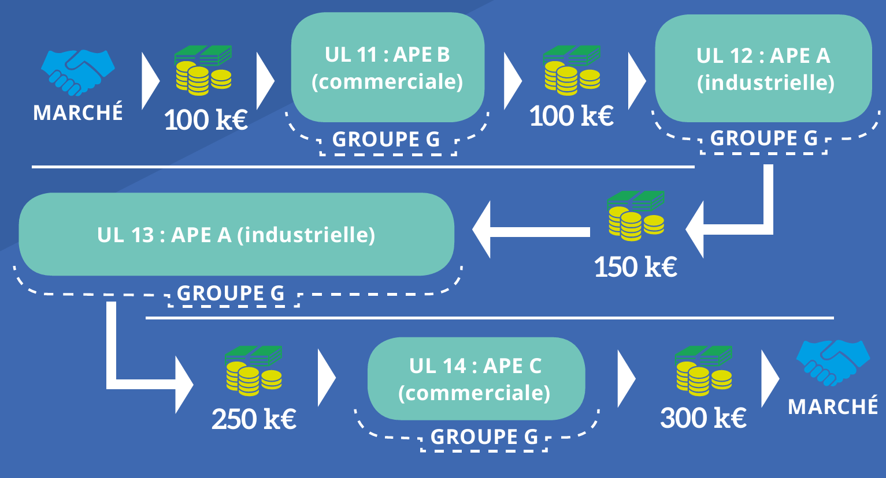

# Secteurs d'activité

Le secteur d'activité d'une entreprise repose sur deux principaux concepts : la nomenclature d'activités française et l'activité principale.&#x20;

## Nomenclature d'activités française

La nomenclature d'activités française (NAF) vise à segmenter l'activité des entreprises en groupes homogènes. Elle est disponible à plusieurs niveaux d'agrégation (A17 ; A38 ; etc.) sur le site de [l'Insee](https://www.insee.fr/fr/information/2406147).&#x20;

Sans être exhaustif, plusieurs points d'attention sont à signaler :&#x20;

* Les boulangeries sont enregistrées au sein de l'industrie manufacturière (10.70) et non en commerce de détail en raison de leur activité de production.
* Les producteurs-vendeurs locaux de fruits, légumes, fromages, peuvent également être enregistrés en industrie manufacturière.
* Le secteur de la construction inclus les travaux de rénovation des ménages (43)
* La vente de produits à base de tabac (47.26) est enregistrée au sein du commerce de détail alimentaire en magasin spécialisé (47.2).
* Les activités des sociétés de holding financières (64.2) sont enregistrées au sein du secteur financier (64)
* Les activités des sièges sociaux (70.1) sont enregistrées au sein des services professionnels, scientifiques et techniques (M)

## Activité principale d'une entreprise

Afin d'attribuer un unique secteur d'activité à une entreprise pouvant réaliser des activités variées, la statistique publique utilise la notion d'activité principale exercée (APE) définie de la manière suivante :&#x20;

> L'activité principale exercée (APE) par une unité, est, parmi ses activités, celle qui génère le plus de valeur ajoutée.
>
> Elle est déterminée en fonction de la ventilation des différentes activités de l'unité statistique concernée (entreprise, unité légale, établissement). En pratique, comme la valeur ajoutée des différentes branches d'activité est souvent difficile à déterminer à partir des enquêtes statistiques, c'est la ventilation du chiffre d'affaires selon les branches qui est utilisée comme critère de détermination.
>
> __[_source : Insee_](https://www.insee.fr/fr/metadonnees/definition/c1888)__


L'activité de [profilage](https://www.insee.fr/fr/information/4168409?sommaire=4168411) réalisée par l'Insee a un impact important sur l'activité principale des entreprises. Le profilage vise à découper un groupe d'entreprises en entreprises au sens de la loi de modernisation de l'économie (LME) de 2008.&#x20;

L'entreprise étant définie comme un "ensemble d'unités légales organisées en vue d'une production de biens et de services et jouissant d’une certaine autonomie de décision, notamment pour l’affectation de leurs ressources courantes", celles-ci peuvent exercer une activité différente de celle du groupe.&#x20;


<figure><figcaption>
<strong>Description simplifiée des flux au sein d’un groupe, source :</strong> <a href="https://www.insee.fr/fr/information/4168409?sommaire=4168411"><strong>Insee</strong></a><strong></strong>
</figcaption></figure>

<figure><figcaption>
<strong>Liens entre les différents types d’unités et les répertoires associés, source :</strong> <a href="https://www.insee.fr/fr/information/4168409?sommaire=4168411"><strong>Insee</strong></a><strong></strong>
</figcaption></figure>
